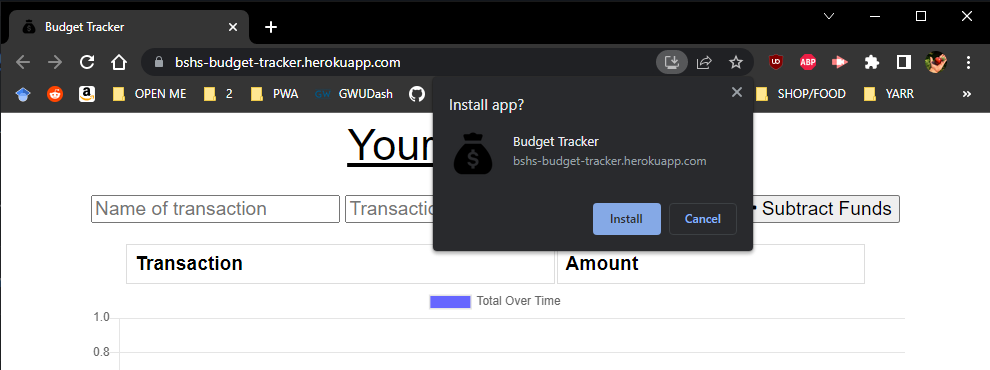
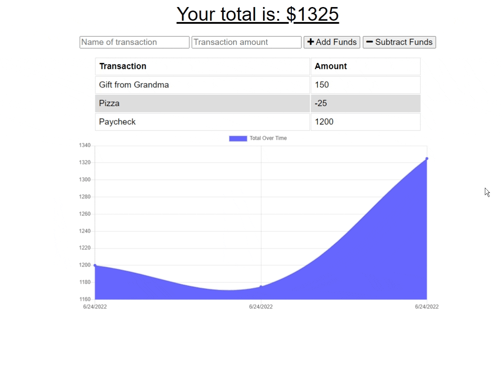

# Budget Tracker

## Table of Contents

* [Description](#description)
* [Installation](#installation)
* [Usage](#usage)
* [Additional Information](#additional-information)

## [Description:](#table-of-contents)
**Budget Tracker** is a simple to use [Progressive Web Application/PWA](https://developer.mozilla.org/en-US/docs/Web/Progressive_web_apps) project application that allows users to keep track of their expenses. The project was completed as a demonstration of creating offline functionality and operating as a [PWA](https://developer.mozilla.org/en-US/docs/Web/Progressive_web_apps). Using **IndexedDb**, transaction data is saved to the browser, and pushed to a MongoDB database on reconnection. Additionally, it uses a simple **Service Worker** to cache important files and a web **manifest** file to make it a downloadable [PWA](https://developer.mozilla.org/en-US/docs/Web/Progressive_web_apps). Fully deployed [here on Heroku](https://bshs-budget-tracker.herokuapp.com/).

_User Story:_
```
AS AN avid traveler
I WANT to be able to track my withdrawals and deposits with or without a data/internet connection
SO THAT my account balance is accurate when I am traveling 
```


## [Installation:](#table-of-contents)

Starter code provided by GWU's Coding Bootcamp. The fully deployed application is available [here on Heroku](https://bshs-budget-tracker.herokuapp.com/). If you are interested in working with this code base, follow these instructions: 
1. Clone this repository with `git clone`
2. Install dependecies with `npm install`
3. Start server with `npm start`
4. Visit `http://localhost:3001` to use the application locally

To install the **Budget Tracker PWA**, navigate to the [deployed URL](). On the right side of the URL, click the _Install Budget Tracker_ download button to install the application on your local machine.



## [Usage:](#table-of-contents)

**Budget Tracker** is super simple to use! Input a name for your transaction, dollar/currency amount, and select whether this transaction will be *adding* or *subtracting* funds. The graph will immediately update to display your updated budget on success. If using this application on a severed or weak connection, all functionality is the same, but when a connection is re-established your transactions will be automatically pushed to the online Mongo database.



Demonstrated here, a transaction is successfully made with no internet connection, and once a connection has been re-established, the data is pushed to the database:


## [Additional Information](#table-of-contents)
Technologies Used:
- Node.js
- Express.js
- HTML / CSS
- MongoDB
- IndexedDb
- Service Workers
- Web Manifests

_If you have any questions about the application, would like to check out more of my work, or would like to become a contributor, please contact me using the information below:_

[GitHub](https://github.com/blindsweatyhansolo)